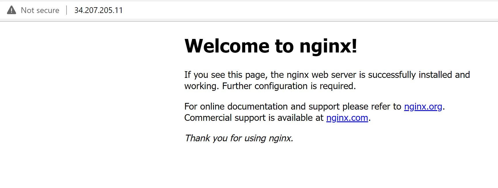
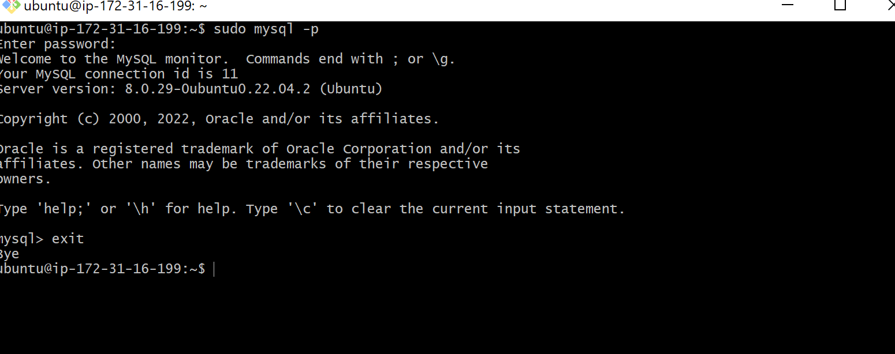
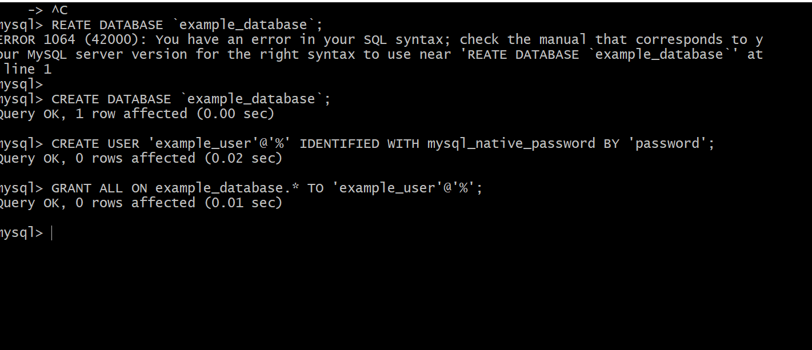

# PROJECT TWO: LEMP IMPLEMENTATION

### This project involves using LEMP (Linux, Nginx, MySQL and PHP/Pyton)

### As in project 1, this involves six(6) steps:

## STEP ONE:

### This involves installing the NginX web server.

### I used Gitbash to connect to my instance:

### Once connected, I installed the Nginx into my SSH. This is done by first updating my SSH and then installing the Nginx server using the *apt* command. Worth nothing is the *sudo* used in the SSH.

`sudo apt update`
`sudo apt install nginx` 

### Once installed, it is always a good practice to check by running:
`sudo systemctl status nginx`

### Other useful commands are:
`sudo apt start`
`sudo apt stop`
`sudo apt restart`

### As port 22 is open by defaul for the SSH connection, we need to open anothe port TCP 80 to run the Nginx server.

### We can confirm this in the shell by running a curl command:
`curl http://localhost:80`

### The script of Nginx installed in shell will look like this;

### Another way to confirm this is by running it on any web browser

[Nginx Run on a web browser](http://localhost:80)

### The above link will show the below(Instance might be closed by myself and so might not exist anymore)

### The 2 examples are the same. One run in a shell and one displayed nicely by the web browser.

## STEP TWO: INSTALLING MYSQL

### Now that the web browser is running, to proceed to the next stage is to connect a database that will store all the data to be used on the website/server. The database to be installed is the SQL server.

### Again I am going to use the *apt* command to install the database
 

`sudo apt install mysql-server`

### Once installed, I can log into the database by running:
`sudo mysql`

### It is worth nothing that all SQL comes installed unsecured and it is important to install a secure level by removing the default security. This is done by adding the code:

`ALTER USER 'root'@'localhost' IDENTIFIED WITH mysql_native_password BY 'PassWord.1';`

### Once done, exit the database by running the code in the mysql:

`exit`

### Once this is done, a secure password can be made by running:

`sudo mysql_secure_installation`
### It is worth nothing that a secure password is recommended and there are different levels of password strength. The system will only allow strong password with numbers and symbols depending on level of security chosed. Strenght runs from 0-1. With 0 being the weakest option and 2 being the strongest password option.

### Once finished, to test if log in is appropriately done, run;

`sudo mysql -p`

### This will prompt the password input and log in.

### Once succesful. log out with;

`exit`

### Below are the images in the SSH showing when mysql is installed and it is running

## STEP THREE: INSTALLING PHP

### Now the Linux is connected to an instance, NginX is installed and running and the database, Mysql, has also been downloaded into the shell. The two needs to be linked and the chosed and most effectively used language is PHP.

### While Apache embeds the PHP interpreter in each request, Nginx requires an external program to handle PHP processing and act as a bridge between the PHP interpreter itself and the web server. This allows for a better overall performance in most PHP-based websites, but it requires additional configuration. I need to install php-fpm, which stands for “PHP fastCGI process manager”, and tell Nginx to pass PHP requests to this software for processing. Additionally, you’ll need php-mysql, a PHP module that allows PHP to communicate with MySQL-based databases. Core PHP packages will automatically be installed as dependencies.

### Both can be installed together by running the code:

`sudo apt install php-fpm php-mysql`

### Once PHP is installed, the NginX needs too be configured to use both the fpm and PHP

## STEP 4 CONFIGURING NGINX TO USE PHP PROCESSOR

### There are 6 stages necessary in doing this.

### STAGE 1: Create a root web directory for ProjectLEMP. The one I will be using is:

`sudo mkdir /var/www/projectLEMP`

### STAGE 2: Assign ownership of the directory by running the code:

`sudo chown -R $USER:$USER /var/www/projectLEMP`

### STAGE THREE:

### Open a new directory in Nginx in the available directory by running:

`sudo nano /etc/nginx/sites-available/projectLEMP`

### This in turn will create a blank page and I will fill it with the code:

`server {
    listen 80;
    server_name projectLEMP www.projectLEMP;
    root /var/www/projectLEMP;

    index index.html index.htm index.php;

    location / {
        try_files $uri $uri/ =404;
    }

    location ~ \.php$ {
        include snippets/fastcgi-php.conf;
        fastcgi_pass unix:/var/run/php/php7.4-fpm.sock;
     }

    location ~ /\.ht {
        deny all;
    }

}`

### STAGE 4:

### Activate the configuration by running:

`sudo ln -s /etc/nginx/sites-available/projectLEMP /etc/nginx/sites-enabled/`

### The code can be checked for syntax errors by running:

`sudo nginx -t`
### The shell should return syntax okay message.

### STAGE 5:Once done, reload the Nginx by using:

`sudo systemctl reload nginx`

### The new website is now active but the root created in step 1 above is empty and we need to populate this by creating an index.HTML file.
### This can be done by using the code:

`sudo echo 'Hello LEMP from hostname' $(curl -s http://169.254.169.254/latest/meta-data/public-hostname) 'with public IP' $(curl -s http://169.254.169.254/latest/meta-data/public-ipv4) > /var/www/projectLEMP/index.html`

### This will lead to the final step

### STAGE 6:
### Running the website should display the message in the above index.php file.

### Alternatively, we can run the filr using the Public IP address as shown below. However, replace with created IP address.

[Opening with web browser](http://<Public-IP-Address>:80)

### As seen in the image above, it means the website is working as it should be.

## STEP 5: TESTING PHP WITH NGINX

### At this stage, the LEMP stack completely installed and functional/operational.

### I can test if the Nginx can correctly run the installed PHP processor.
### This can be done by creating a PHP file in the document root directory created earlier. I will call this info.php file by running the code:

`sudo nano /var/www/projectLEMP/info.php`

### After that, I can display the basic PHP file by running the PHP code that will display indoemation about my server:

`<?php
phpinfo();`

### It is advisable to remove the above test file as it reveals information that can be useful to hackers.

### This can be done by running:

`sudo rm /var/www/your_domain/info.php`

## STEP 6:RETRIEVING DATA FROM MYSQL DATABASE WITH PHP

### This will be done by:

### 1. Creating a database: First connecting to the MYSQL using the root user using:

`sudo mysql`
### Now I am in the mysql console.

### Once in, create a new database by running:
`CREATE DATABASE `example_database`;`

### 2. Creating a new user with a password to grant the user permission to use the database by running the command in Mysql:
`CREATE USER 'example_user'@'%' IDENTIFIED WITH mysql_native_password BY 'password';`
### Then grant the user permission to use the new database created:
`GRANT ALL ON example_database.* TO 'example_user'@'%';`

### This will give the user permission over the database while at the same time preventing the user from creating or modifying a new database on my server.

### The database can be exited to confirm if the new user can log in with the new permission and user name by firstly exiting the database

`exit`

### Re login by running;

`mysql -u example_user -p`

### This will prompt the user to provide the login details.

### Once in, run the command to see if the database has been created and has access by running:

`SHOW DATABASES;`

### This will show the databases available. 

### I then create a table by running:

`CREATE TABLE example_database.todo_list (
     item_id INT AUTO_INCREMENT,
     content VARCHAR(255),
     PRIMARY KEY(item_id)
 );`
 

### 3. Create a test table and populate the table

### The table can be populated by running the command:
 `INSERT INTO example_database.todo_list (content) VALUES ("My first important item");`

 ### To insert multiple values, rerun the above command for each value and replacing the content.

### To check if the table has been correctly populated, I ran the command:
`SELECT * FROM example_database.todo_list;`

### 4. Create a PHP file in my directory and run a PHP script to query the database and display the result on the webserver/website using the created root directory.

`nano /var/www/projectLEMP/todo_list.php` 
### This creates the new file that now needs to be populated and displayed. To do this, I need to run:

`<?php
$user = "example_user";
$password = "password";
$database = "example_database";
$table = "todo_list";

try {
  $db = new PDO("mysql:host=localhost;dbname=$database", $user, $password);
  echo "<h2>TODO</h2><ol>";
  foreach($db->query("SELECT content FROM $table") as $row) {
    echo "<li>" . $row['content'] . "</li>";
  }
  echo "</ol>";
} catch (PDOException $e) {
    print "Error!: " . $e->getMessage() . " ";
    die();
}`

### The above scripts connects the database and also query the database to run the populated table on the webserver.
### This needs to be saved and closed.

### Once closed, the page can now be run on the web by using the IP address with /todolist.php attached.

[IP Address](http://<Public_domain_or_IP>/todo_list.php)

